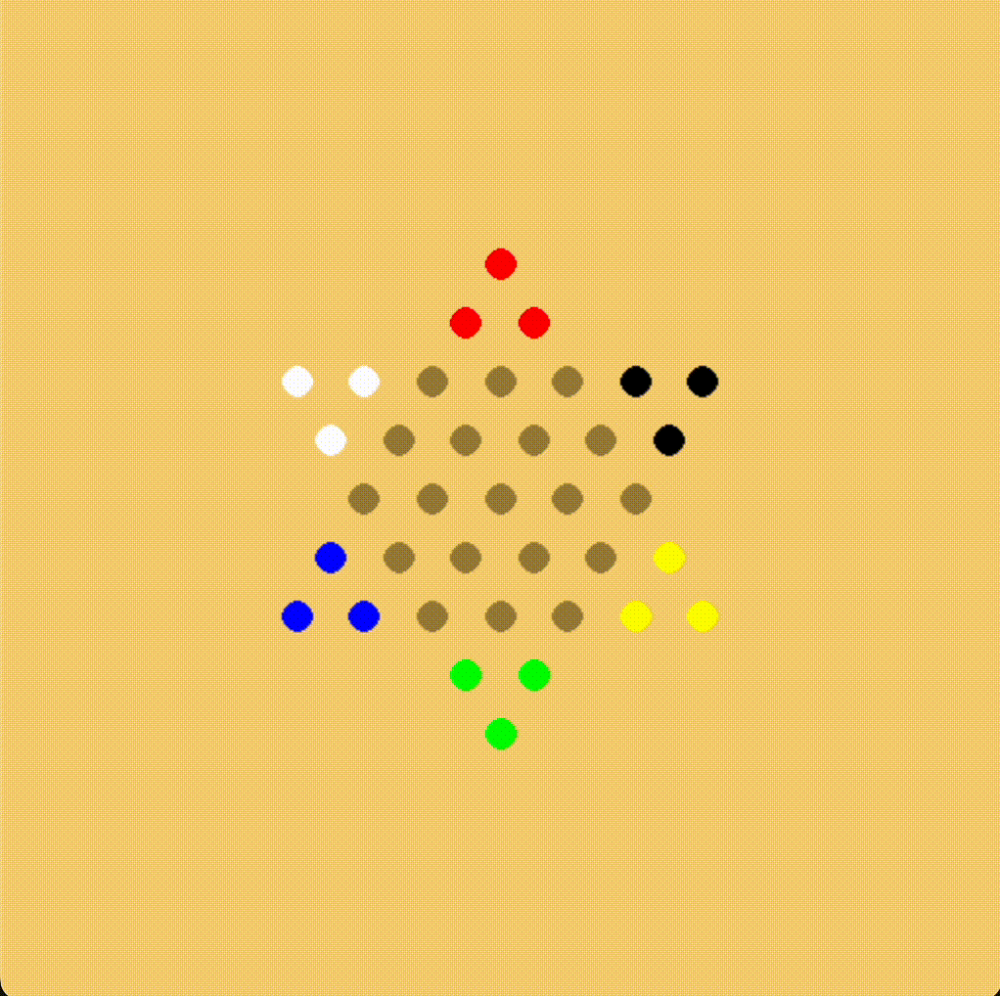

# CS 285 Final Project - Fall 2023

<i>Self-play of a PPO agent trained with full parameter sharing on our custom Chinese Checkers environment. 
</i>

 

In this project, we analyze MARL parameter sharing techniques for multi-agent competitive environments. We create a new custom environment for Chinese checkers and train PPO agents through three different approaches:

1. Full parameter sharing - Agents share all parameters in the network.
2. Shared encoder - Agents share an encoder but have unique policy and value function heads.
3. Fully independent - Agents share no parameters across their networks.
